# Spring Boot
<ol>
<li><h3>JBK</h3></li>

In this project <b>@RequestMApping(Value="", method= RequestMethod.[method])</b> annotation is used for API Creation.
  
<ul>
  <li>@RequestMapping: 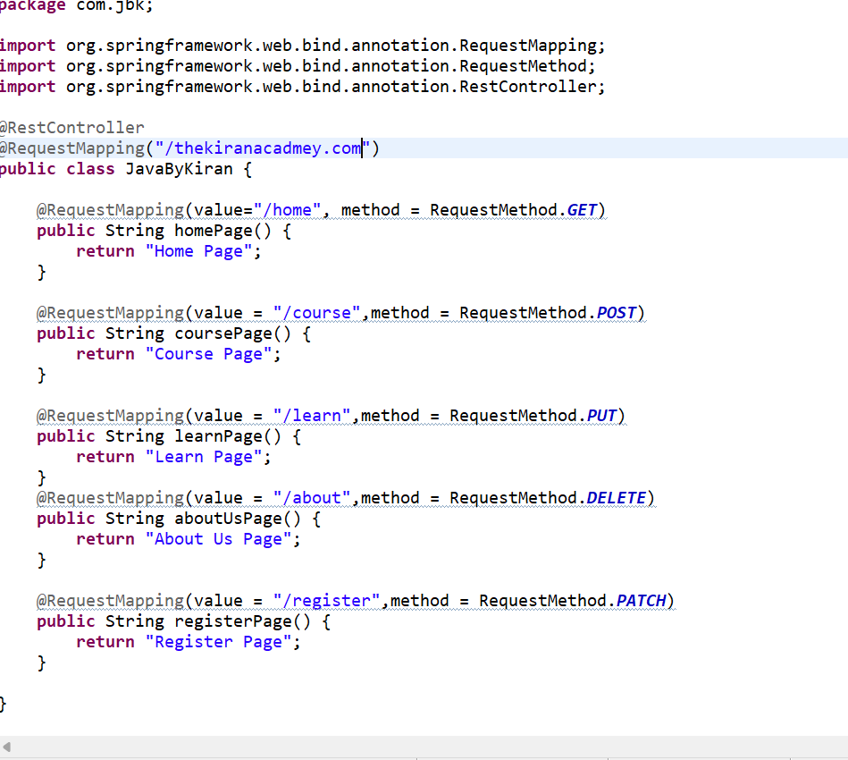</li>
   <li>Get: 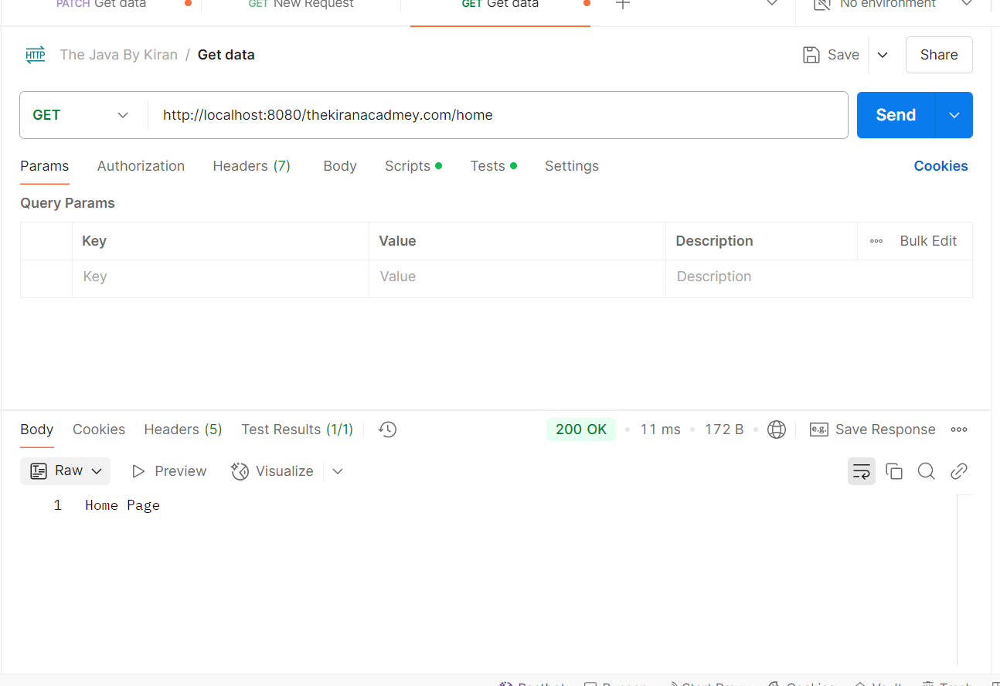</li>
   <li>Post: 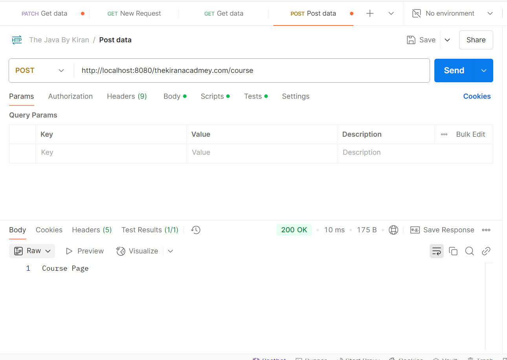</li>
   <li>Put: 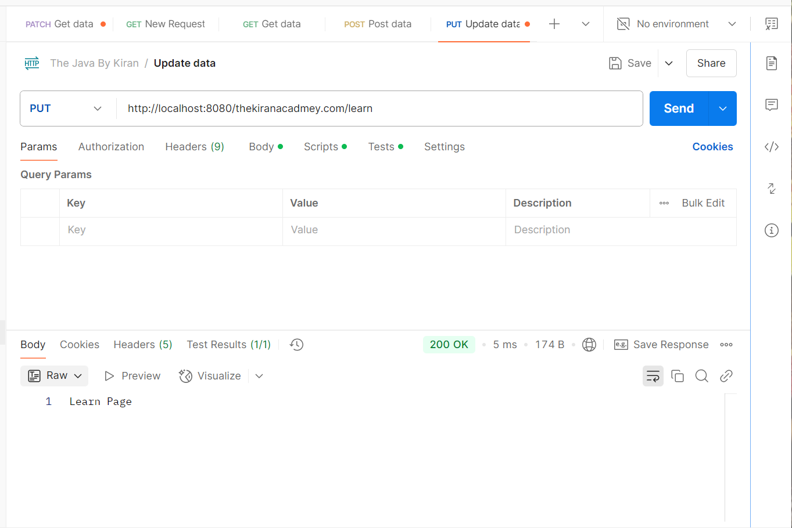</li>
   <li>Delete: 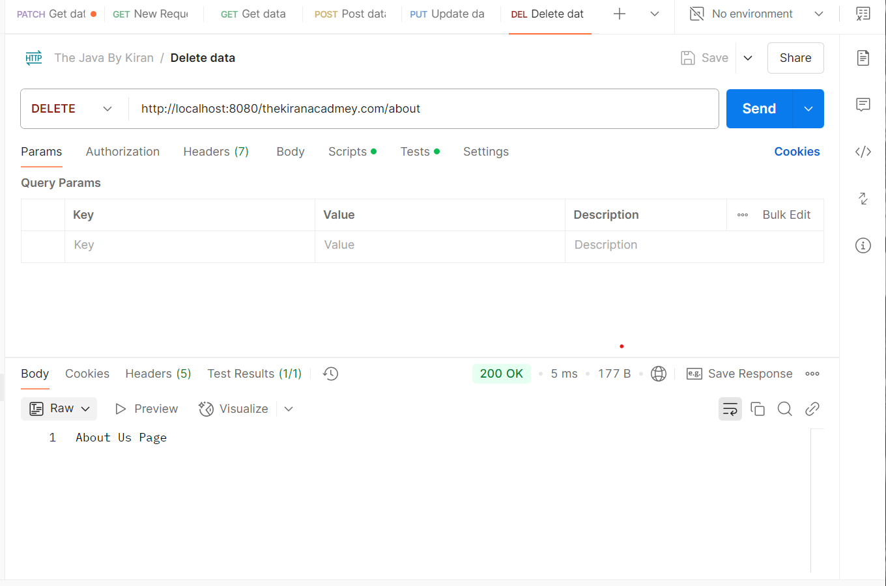</li>
   <li>Patch: 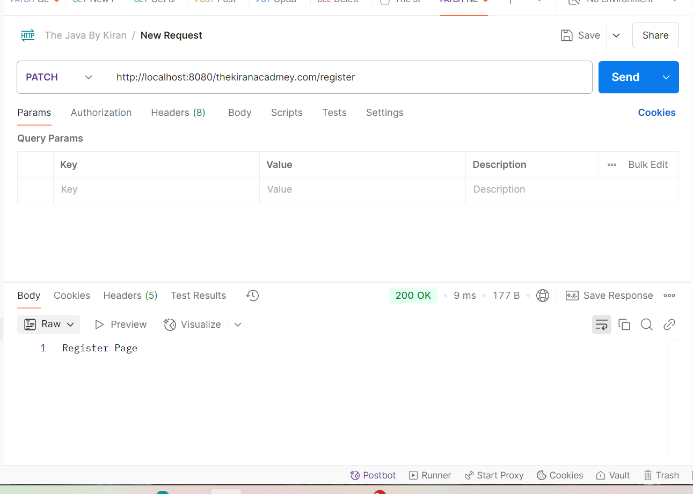</li>
     
</ul>

<li><h3>Linkedin</h3></li>

In this project<b> @PostMapping , @GetMapping,@PutMapping,@DeleteMapping,@PatchMapping </b>annotations are used for API Creation.
 
<ul>
  <li>@[Method]Mapping: 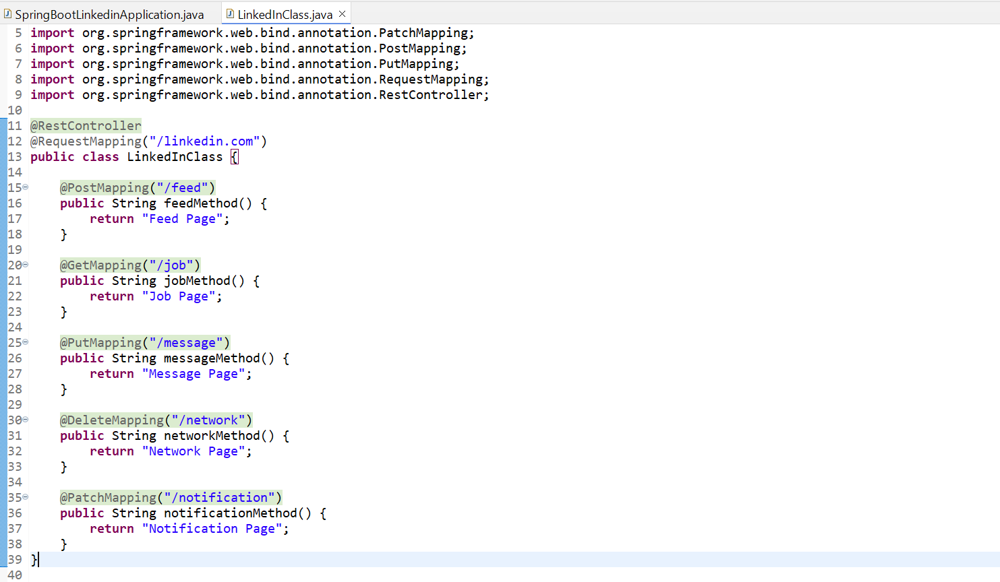</li>
   <li>Get: 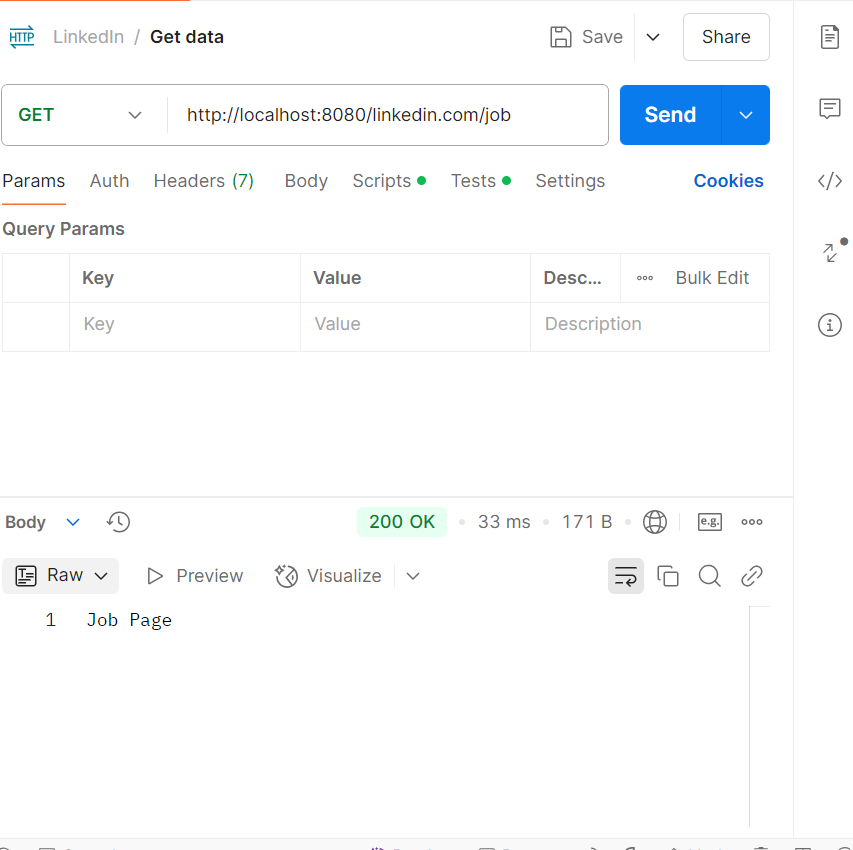</li>
   <li>Post: 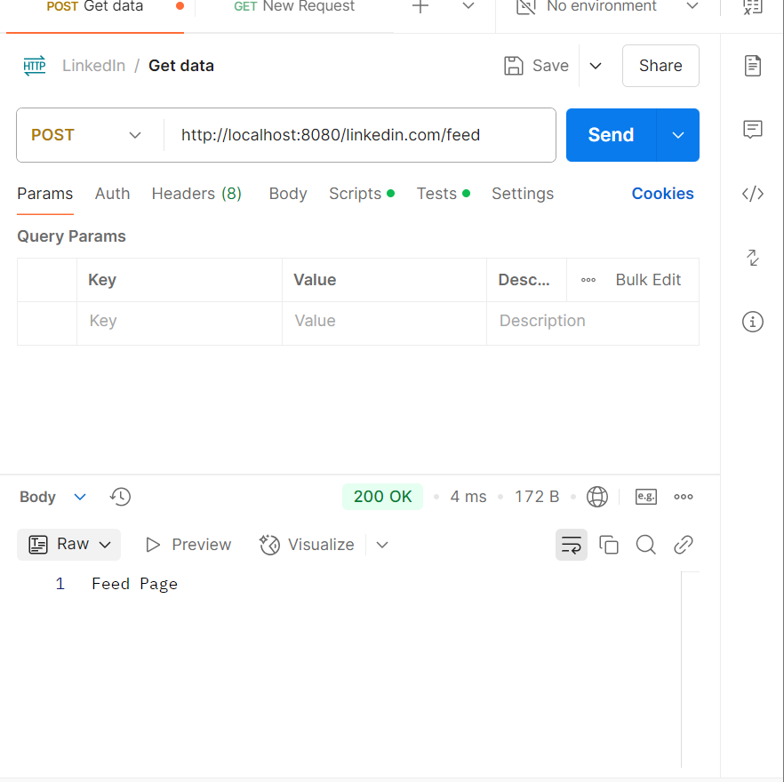</li>
   <li>Put: 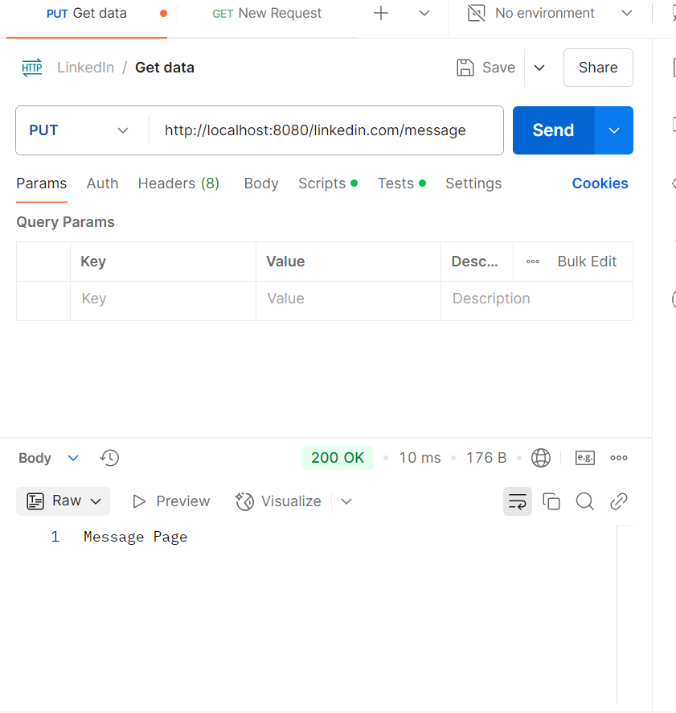</li>
   <li>Delete: 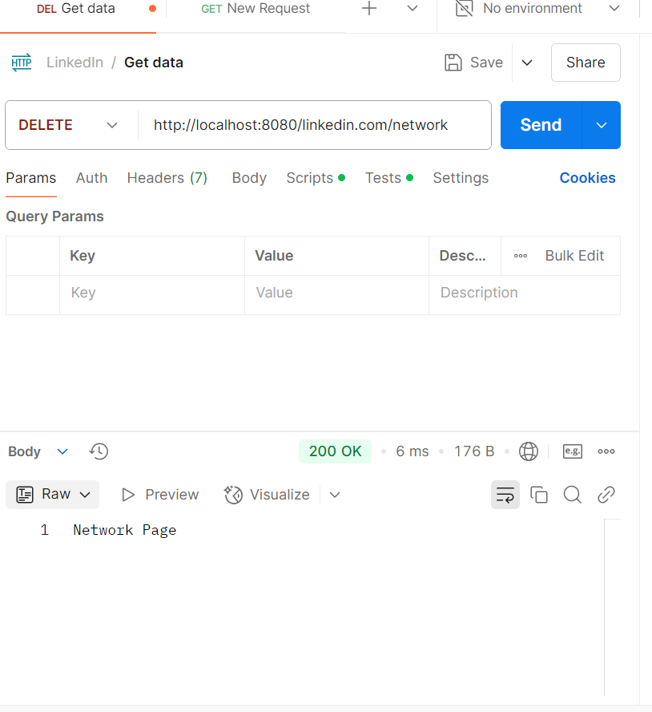</li>
   <li>Patch: 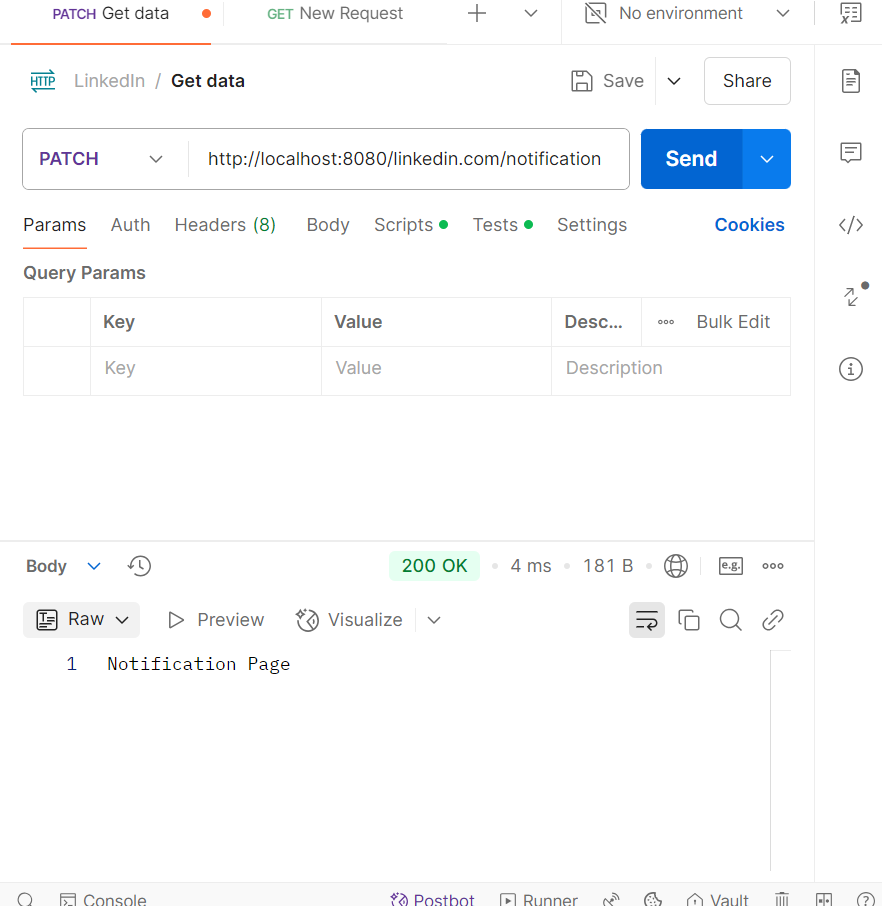</li>
</ul>
</ol>
